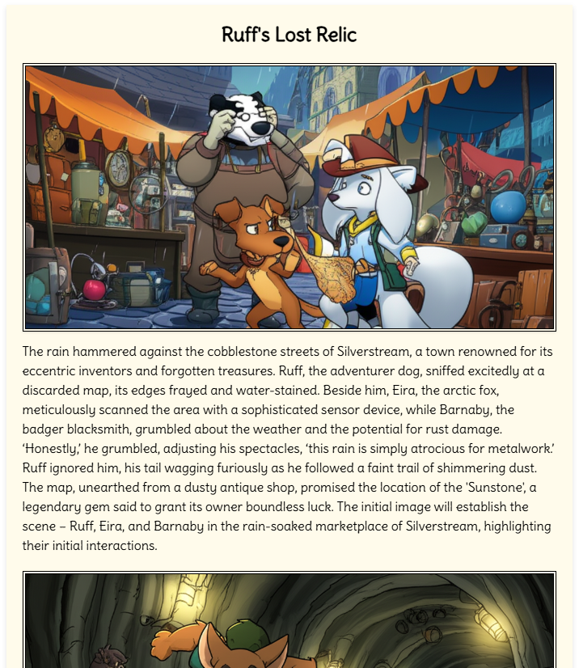

# Book Craft AI



Book Craft AI is a Rust-based tool that generates illustrated storybooks from a single prompt using LLMs (Ollama) and image generation (Gemini). It outputs a structured HTML book with images and text, following a consistent visual theme.

## Features

- **Prompt to Story**: Converts a short prompt into a detailed, multi-section story.
- **Image Generation**: Creates scene illustrations for each story section using Gemini API.
- **HTML Output**: Generates a styled HTML book with embedded images.

## Usage

1. **Configure**: Edit [`config.toml`](config.toml) with your Gemini API key and Ollama host/port.
2. **Run**:
   ```sh
   cargo run -- "A short prompt for your story"
   ```

## Configuration

The tool is configured using a `config.toml` file, which includes settings for directories, Gemini API, and Ollama host/port.

```toml
[directory]
books = "books"
instruction = "instruction.txt"

[gemini]
api_key = "<YOUR_GEMINI_API_KEY>"
api_url = "https://generativelanguage.googleapis.com/v1beta/models/gemini-2.0-flash-preview-image-generation:generateContent"

[ollama]
host = "http://localhost"
port = 11434
```